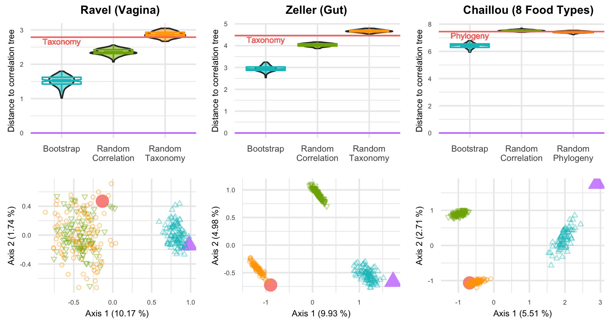

<script>
var slideshow = remark.create({
  highlightStyle: "github",
  highlightLines: true,
  countIncrementalSlides: false,
  ratio: "16:10",
  slideNumberFormat: function (current) {
    final = this.getSlideByName("final").getSlideNumber()
    if (current <= final) {
    return current + ' / ' + final;
    } else {
    return current;
    }
  },
  navigation: {
   scroll: false
  }});
</script>

```{r setup, include=FALSE}
options(htmltools.dir.version = FALSE)
```

```{r icons-emojis, message=FALSE, echo=FALSE}
# remotes::install_github("ropenscilabs/icon")
# remotes::install_github("hadley/emo")
```

```{r packages, message=FALSE, echo=FALSE}
library(magrittr)
library(flextable)
library(officer)
library(RefManageR)
```


```{r, load_refs, include=FALSE, cache=FALSE}
BibOptions(check.entries = FALSE,
           bib.style = "authortitle",
           cite.style = "alphabetic",
           style = "markdown",
           hyperlink = FALSE,
           dashed = TRUE, 
           max.names = 2)
bib <- ReadBib("biblio.bib", check = FALSE)
Cite(bib, unname(names(bib))) 
```


<br><br>

<table style="border:0px">
<tr>
<td>
  <center>
   <br>
  C. Ambroise
  </center>
</td>
<td>
</td>
<td>
  <center>
   <br>
  M. Mariadassou
  </center>
</td>
<td>
</td>
<td>
  <center>
   <br>
  J. Plassais
  </center>
</td>
<td>
</td>
<td>
  <center>
   <br>
  F. Strozzi
  </center>
</td>
</tr>
</table>


<br>


<table style="border:0px">
<tr>
<td>
  <center>
  
  </center>
</td>
<td>
</td>
<td>
  <center>
  
  </center>
</td>
<td>
</td>
<td>
  <center>
  
  </center>
</td>
<td>
</td>
<td>
  <center>
  
  </center>
</td>
</tr>
</table>


---
class: inverse, center, middle

# Context

---
name: microbiota
# Microbiota

_Ecological community of microorganisms that reside in an environmental niche._ 

---
template: microbiota
count: false

```{r refmicrobiote, echo=FALSE}
ref_microbiota <- c("ley2006ecological", "flint2012microbial", "canani2011potential")
```

.footnote[`r emo::ji("page_facing_up")` `r Citet(bib, ref_microbiota)`]

```{r, child='human_gut.Rmd'}
```

---
template: microbiota
count: false

.footnote[`r emo::ji("page_facing_up")` `r Citet(bib, ref_microbiota)` – `r emo::ji("framed_picture")`  [lelivrescolaire.fr](https://www.lelivrescolaire.fr/books/6067633)]

```{r, child='human_gut.Rmd'}
```

.pull-right[
<center>
  
</center>
]

---
# Microbiota everywhere


.footnote[`r emo::ji("framed_picture")` [MicrobiomeSupport](https://www.microbiomesupport.eu/infographics/)]

<center>
  
</center>


---
# Sequencing


.footnote[`r emo::ji("page_facing_up")` `r Citet(bib, "cryan2019microbiota")`]


<center>
  
</center>

---
# Abundance table


* Matrix with $m$ taxa and $p$ samples.

* Count or compositional data, with inflation in zero.

* Correlation between abundances.

--

.footnote[`r emo::ji("page_facing_up")` `r Citet(bib, "brito2016mobile")`]

.pull-left[
```{r abund, echo=FALSE, message=FALSE}
load("data/abundance.Rds")
color_zero <- "red"
X %>% 
  as.data.frame(row.names = FALSE) %>% 
  cbind(species = rownames(X), .) %>% 
  flextable() %>% 
  set_header_labels(species = "") %>% 
  theme_alafoli() %>% 
  bold(part = "header") %>% 
  italic(i = 1:8, j = 1) %>% 
  color(~ S1 == 0, ~ S1, color = color_zero) %>% 
  color(~ S2 == 0, ~ S2, color = color_zero) %>% 
  color(~ S3 == 0, ~ S3, color = color_zero) %>% 
  color(~ S4 == 0, ~ S4, color = color_zero) %>% 
  color(~ S5 == 0, ~ S5, color = color_zero) %>% 
  color(~ S6 == 0, ~ S6, color = color_zero) %>% 
  hline(i = 1:7, j = 1:7, border = fp_border(color = "grey")) %>% 
  width(j = 1, width = 2)
```
]

--

.pull-right[
<center>
  
</center>
]


---
# Phylogeny 

.footnote[`r emo::ji("page_facing_up")` `r Citet(bib, "brito2016mobile")`]

* Tree with $m$ leaves which describes the evolutionary history of the taxa.

--

* Associated with a patristic distance matrix $\left(d_{i,j}\right)_{i,j}$.

<center>
  
</center>

---

# Differential abundance studies

<center>
  
</center>


Used to find **associations** between microbiota and

<div style = "margin-top: -30px"></div>

<table style="border:0px">
<tr>
<td>
<ul>
<li><p>diet `r Citep(bib, "david2014diet")`,</p></li>
<li><p>birth mode `r Citep(bib, "bokulich2016antibiotics")`,</p></li>
<li><p>age `r Citep(bib, "yatsunenko2012human")`,</p></li>
</ul>
</td>
<td>
</td>
<td>
<ul>
<li><p>pet owning `r Citep(bib, "kates2020household")`,</p></li>
<li><p>tobacco `r Citep(bib, "opstelten2016gut")`,</p></li>
<li><p>antibiotics `r Citep(bib, "palleja2018recovery")`,</p></li>
</ul>
</td>
<td>
</td>
<td>
<ul>
<li><p>Crohn's disease `r Citep(bib, "morgan2012dysfunction")`,</p></li>
<li><p>cirrhosis `r Citep(bib, "qin2014alterations")`</p></li>
<li><p>schizophrenia `r Citep(bib, "zheng2019gut")`...</p></li>
</ul>
</td>
</table>


---
# Classical approach

Vector $\pv \in \mathopen[0,1\mathclose]^m$ of $p$-values, computed on each taxa independently.

Wilcoxon and Kruskal-Wallis non-parametric tests can be used.

--

A taxon $i$ is detected differentially abundant if $\pv_i < \alpha$.

Each taxon fall into one class of the confusion matrix:

```{r confusionmatrix, echo=FALSE}
df_conf <- data.frame(
  col1 = c("", "", "Detection", "Detection"),
  col2 = c("", "", "Positive", "Negative"),
  col3 = c("True condition", "Positive", "TP", "FN"),
  col4 = c("True condition", "Negative", "FP", "TN"))

table_conf <-
  df_conf %>%
  flextable() %>%
  delete_part("header") %>%
  merge_v(j = 1:2) %>%
  merge_h(i = 1) %>%
  align(i = 1, j = 3:4, align = "center") %>%
  align(i = 2:4, j = 2:4, align = "center") %>%
  valign(i = 3, j = 1, valign = "center") %>%
  bg(i = 1:4, j = 1:4, bg = "white") %>%
  bg(i = 3, j = 3, bg = "#A0CF63") %>%
  bg(i = 4, j = 4, bg = "#A0CF63") %>%
  bg(i = 3, j = 4, bg = "#EB524E") %>%
  bg(i = 4, j = 3, bg = "#EB524E") %>%
  hline(i = 1, j = 3:4, border = fp_border(width = 1)) %>%
  hline(i = 2:4, j = 2:4, border = fp_border(width = 1)) %>%
  vline(i = 3:4, j = 1, border = fp_border(width = 1)) %>%
  vline(i = 2:4, j = 2:4, border = fp_border(width = 1)) %>%
  font(fontname = "Open Sans") %>% 
  fontsize(size = 25) %>%
  height_all(10) 

table_conf
```

--

Under $\mathbb{H}_0$, $\pv_i \sim \mathcal{U}(\mathopen[0,1\mathclose])$.


---
# Multiple testing problem

.footnote[`r emo::ji("framed_picture")` [XKCD](https://xkcd.com/882)]

<table style="border:0px">
<tr>
<td>
  <center>
  
  </center>
</td>
<td>
</td>
<td>
</td>
<td>
  <center>
  
  </center>
</td>
</tr>
</table>

---
# TPR and FDR

```{r printconf, echo=FALSE}
table_conf
```

True Positive Rate:

$$\text{TPR} = \frac{\text{TP}}{\text{TP} + \text{FN}}.$$

False Discovery Rate:

$$\text{FDP} = \frac{\text{FP}}{\text{TP} + \text{FP}}\text{, FDR}=\EE{\text{FDP}}.$$

---
# Multiple testing problem correction

.footnote[`r emo::ji("page_facing_up")` `r Citet(bib, "benjamini1995controlling")`]

Correction with Benjamini-Hochberg procedure to respect an _a priori_ FDR : $\qv^{\text{bh}}$.

--

But it assumes independence between taxa and it is not respected.

<center>
  
</center>

---
count: false
# Multiple testing problem correction

.footnote[`r emo::ji("page_facing_up")` `r Citet(bib, c("benjamini1995controlling", "benjamini2001control"))`]

Correction with Benjamini-Hochberg procedure to respect an _a priori_ FDR : $\qv^{\text{bh}}$.

But it assumes independence between taxa and it is not respected.

<center>
  
</center>

One can use Benjamini-Yekutieli correction which does not make any assumption about dependence between taxa but 

 * it's too conservative,
 
 * we want to correct explicitly for correlation between taxa.

---
class: inverse, center, middle

# Incorporation of hierarchical information

---


# Goal

* Correct explicitly for correlation between taxa.

--

* Increase power.

--

* Keep FDR under a desired level.


---
name: rationale
# Rationale

.footnote[`r emo::ji("page_facing_up")` `r Citet(bib, "philippot2010ecological")`]

<center>
  
</center>

---
count: false
# Rationale

.footnote[`r emo::ji("page_facing_up")` `r Citet(bib, "philippot2010ecological")`]

<center>
  
</center>
.center[These species are associated with animals.]

---
count: false
# Rationale

.footnote[`r emo::ji("page_facing_up")` `r Citet(bib, "philippot2010ecological")`]

<center>
  
</center>
.center[These species are associated with soil.]


---
template: rationale
count: false


Already used in 

* Hierarchical FDR `r Citep(bib, c("yekutieli2008hierarchical", "sankaran2014structssi"))`,

* **TreeFDR `r Citep(bib, "xiao2017false")`**.


---
# z-scores smoothing with TreeFDR

$\zs = \Phi^{-1}\left(\pv\right)$ is the vector of observed _z_-scores and $\mu$ the vector of “true” _z_-scores.

--

Assume a hierarchical model: $\left. \zs \mid \mu \right. \sim \mathcal{N}_m\left(\mu,\sigma^2 \mathbf{I}_m\right)$ and $\mu \sim \mathcal{N}_m\left(\gamma \mathbf{1}_m,\tau^2C_{\rho}\right)$ with $C_{\rho} = \left(\exp\left(-2\rho d_{i,j}\right)\right)_{i,j}$.

<center>
  
</center>


---
# z-scores smoothing with TreeFDR

Then $\zs \sim \mathcal{N}_m \left(\gamma \mathbf{1}_m,\tau^2 C_{\rho} + \sigma^2 \mathbf{I}_m\right)$ by Bayes formula and the maximum a posteriori gives 
 
$$\mu^* = \left(\mathbf{I}_m + k^2 C_{\rho}^{-1}\right)\left(k^2 C_{\rho}^{-1} \gamma \mathbf{1}_m + \zs \right),$$

with $k = \frac{\sigma}{\tau}$ and $\rho_0$ hyperparameters to optimize.

--

At the end, a multiple testing correction by resampling is done on smoothed values.

---
# Which tree?

* Phylogeny? Taxonomy? 

`r emo::ji("grinning_face")` Proxy for correlations at high-level niches.

`r emo::ji("frowning_face")` Not so much for low-level niches?

`r emo::ji("frowning_face")` Not available every time.

--

.footnote[`r emo::ji("page_facing_up")` `r Citet(bib, "bichat2020incorporating")`]

* Correlation tree?

`r emo::ji("grinning_face")` Actual correlation between taxa.
  
`r emo::ji("grinning_face")` Always available.
  
`r emo::ji("frowning_face")` Risk of overfitting.


---
# Billera-Holmes-Vogtmann distance

.footnote[`r emo::ji("page_facing_up")` `r Citet(bib, "billera2001geometry")`] 


.pull-left[
  <center></center>
]

.pull-right[

* Each tree is mapped into a space composed by merged orthants.

* An orthant corresponds to a topology.

* The BHV distance is the length of the unique shortest path between the trees on treespace.

* It can be computed with a $O\left(m^4\right)$ algorithm.
]


---
# Quantifying distance between trees


* Trees of primary interest:

  * <span style="color:#C77CFF">correlation tree on original data,</span>
  
  * <span style="color:#F8766D">phylogeny.</span>
  
--

* What is the confidence region for the correlation tree?

  * <span style="color:#00BFC4">correlation trees on boostrapped data (resampling on samples).</span>

--

* Are trees significantly closer than two random trees?

  * <span style="color:#7CAE00">trees created by random shuffling of correlation tree tip labels,</span>
  
  * <span style="color:#FFA500">trees created by random shuffling of phylogeny tip labels.</span>

--

We compute all pairwise distances between these trees.


---
# Comparisons between trees

Neither phylogeny nor taxonomy is in the confident region of the correlation tree.

<center></center>

.footnote[`r emo::ji("page_facing_up")` `r Citep(bib, c("bichat2020incorporating", "ravel2011vaginal", "zeller2014potential", "chaillou2015origin"))`]

---
count: false
# Comparisons between trees

Neither phylogeny nor taxonomy is in the confident region of the correlation tree.

<center></center>

.footnote[`r emo::ji("page_facing_up")` `r Citep(bib, c("bichat2020incorporating", "ravel2011vaginal", "zeller2014potential", "chaillou2015origin"))`]

---
# Impact of the tree with Zeller dataset

.footnote[`r emo::ji("page_facing_up")` `r Citet(bib, c("bichat2020incorporating", "zeller2014potential"))`]

All hierarchies give highly similar results.

.pull-left[
<center>
  
</center>
]

.pull-right[
* 119 genera

* 199 patients 
  * 66 healthy
  * 42 adenoma
  * 91 colorectal cancer
]


---
class: inverse, center, middle

# zazou

### Z-scores AZ Ornstein-Uhlenbeck

---
# Ornstein-Uhlenbeck process 

An Ornstein-Uhlenbeck (OU) process with an optimal value of $\ou{\optim}$ and a strength of selection $\ou{\alpha} > 0$ is a Gaussian process that satisfies the SDE

$$\dx{W_t} = -\ou{\alpha} (W_t - \ou{\optim}) \dx{t} + \ou{\sigma}\dx{B_t}.$$


.pull-left[
<center>
  
</center>
]

--

.pull-right[

$W_t$ is Gaussian with bounded variance and 

$$W_t \xrightarrow[t\rightarrow\infty]{} \normal{\ou{\optim}}{\frac{\ou{\sigma}^2}{2\ou{\alpha}}}.$$
]


---
# OU process on a tree with shifts $\shifts$

.footnote[`r emo::ji("page_facing_up")` `r Citet(bib, "bastide2017detection")`]

<center>
  
</center>

--

* On a branch, the process behaves like on $\RR_+$.

--

* At each node, the process splits into two independent processes with the same initial value.

--

* The optimal value can shift at a node.


---
# Incidence matrix and vector of shifts

.pull-left[
<center>
  
</center>
]


$T = (\indic_{\{i \in \desc(j)\}})_{ij} \in\{0,1\}^{m \times n}$ is the incidence matrix of the tree:

$$
\begin{bmatrix}
1 & \color{#4aac8b}{0} & \color{#cc5561}{1} & \color{#bf6e3f}{1} & \color{#c55d93}{1} & \color{#6da148}{0} & \color{#9d63cb}{0} & \color{#c3a030}{0} & \color{#7088c8}{0} \\
1 & \color{#4aac8b}{0} & \color{#cc5561}{1} & \color{#bf6e3f}{1} & \color{#c55d93}{0} & \color{#6da148}{1} & \color{#9d63cb}{0} & \color{#c3a030}{0} & \color{#7088c8}{0} \\
1 & \color{#4aac8b}{0} & \color{#cc5561}{1} & \color{#bf6e3f}{0} & \color{#c55d93}{0} & \color{#6da148}{0} & \color{#9d63cb}{1} & \color{#c3a030}{0} & \color{#7088c8}{0} \\
1 & \color{#4aac8b}{1} & \color{#cc5561}{0} & \color{#bf6e3f}{0} & \color{#c55d93}{0} & \color{#6da148}{0} & \color{#9d63cb}{0} & \color{#c3a030}{1} & \color{#7088c8}{0} \\
1 & \color{#4aac8b}{1} & \color{#cc5561}{0} & \color{#bf6e3f}{0} & \color{#c55d93}{0} & \color{#6da148}{0} & \color{#9d63cb}{0} & \color{#c3a030}{0} & \color{#7088c8}{1} \\
\end{bmatrix}
$$

--

and $\shifts$ the vector of shifts:

$$\begin{bmatrix} 0 & \color{#4aac8b}{0} & \color{#cc5561}{0} & \color{#bf6e3f}{4} & \color{#c55d93}{0} & \color{#6da148}{0} & \color{#9d63cb}{0} & \color{#c3a030}{0} & \color{#7088c8}{0} \end{bmatrix}^T.$$
--

The product $T\delta$ is the vector of optimal values on leaves.

---
# Random variables on leaves


<center>
  
</center>


The random variables on leaves are jointly Gaussian $\mathcal{N}_m\left(T\shifts, \Sigma \right)$ with 

$$\Sigma_{i, j} = \frac{\ou{\sigma}^2}{2\ou{\alpha}}\left(1 - e^{-2\ou{\alpha} t_{i,j} }\right) \times e^{-\ou{\alpha} d_{i,j}}.$$

---
# First assumption

$\mathfrak{z}$ is the realization of an OU on a tree with shifts $\delta$.

--

Then,

$$
\zs \sim \mathcal{N}_m\left(\mu,\Sigma\right)
$$

with $\mu = T\delta$ and $\Sigma$ depends on $\alpha_{\text{ou}}$ and $\sigma_{\text{ou}}$ by 

$$\Sigma_{i,j} = \frac{\ou{\sigma}^2}{2\ou{\alpha}}\left(e^{-\ou{\alpha} d_{i,j}} - e^{-2\ou{\alpha} h}\right)$$

for a tree with total height $h$.

---
name: secondassumption
# Second assumption

.footnote[`r emo::ji("page_facing_up")` `r Citet(bib, "mclachlan2004finite")`]

For a taxa $i$, 

* if $\mathcal{H}_i \in \mathbb{H}_0$, $\mathfrak{p}_i \sim \mathcal{U}(\mathopen[0,1\mathclose])$ so $\mathfrak{z}_i \sim \mathcal{N}(0,1)$,

* if $\mathcal{H}_i \notin \mathbb{H}_0$, $\mathfrak{p}_i \preccurlyeq \mathcal{U}(\mathopen[0,1\mathclose])$ so $\mathfrak{z}_i \sim \mathcal{N}(\mu_i,1)$ with $\mu_i \lt 0$.

---
template: secondassumption
count: false

<center>
  
</center>

---
template: secondassumption
count: false

Then,

$$\mathfrak{z} \sim \mathcal{N}_m\left(\mu \in \RR_-^m, \Sigma\right).$$


One will find **differentially abundant** taxa by finding the **non-zero elements** of $\mu$.

This impose $\Sigma_{i,i} = 1$ so $\ou{\sigma}=\frac{2\ou{\alpha}}{1 - e^{-2\ou{\alpha}h}}$.


---
# Estimation of $\mu$ 

With $\Sigma$ known, a naive ML estimator gives


$$\hat{\mu} = \argmin_{\mu\in\RR_-^m} \|\mathfrak{z} - \mu\|_{\Sigma^{-1}, 2}^2.$$

--

To take the tree into account, $\hat{\mu} = T\hat{\shifts}$ with

$$\hat{\shifts} = \argmin_{\shifts\in \RR^{n} / T\shifts \in\RR_-^m} \left\|\mathfrak{z} - T\shifts\right\|_{\Sigma^{-1},2}^2.$$

--

To add hierarchically coherent sparsity in our estimate 

$$\hat{\shifts} = \argmin_{\shifts\in \RR^{n} / T\shifts \in\RR_-^m} \left\|\mathfrak{z} - T\shifts\right\|_{\Sigma^{-1},2}^2 + \lambda \|\shifts\|_1.$$

---
# Estimation of $\mu$ (bis)

By Cholesky decomposition, $\Sigma^{-1} = R^TR$

\begin{align*}
\left\|\mathfrak{z} - T\shifts\right\|_{\Sigma^{-1},2}^2 & = \left(\mathfrak{z} - T\shifts\right)^T\Sigma^{-1}\left(\mathfrak{z} - T\shifts\right)  \\
& = \left(\mathfrak{z} - T\shifts\right)^TR^TR\left(\mathfrak{z} - T\shifts\right)   \\
& = \left(R\mathfrak{z} - RT\shifts\right)^T\left(R\mathfrak{z} - RT\shifts\right) \\
& = \left(y - X\shifts\right)^T\left(y - X\shifts\right) = \left\|y - X\shifts\right\|_2^2
\end{align*}

with $y = R\mathfrak{z}$ and $X = RT$.

--

Finally, we fall back to a constrained lasso problem:

$$\hat{\shifts} = \argmin_{\shifts\in \RR^{n} / T\shifts \in\RR_-^m} \left\|y - X\shifts\right\|_2^2 + \lambda \|\shifts\|_1.$$

---
# Numerical resolution

.footnote[`r emo::ji("page_facing_up")` `r Citet(bib, "fu1998penalized")`]

The previous problem could be numerically solved by the shooting algorithm, **iterating unidirectional updates** form the associated problem:

\begin{equation}
\left\{
  \begin{aligned}
    \argmin_{\param \in \RR} h(\param) & = \frac{1}{2} \|y - z - x\param\|^2_2 + \lambda |\param| \\
    & \text{s.t. } u + v\param \leq 0.
  \end{aligned}
\right.
\end{equation}

--

<br>

But $\Sigma$ and $\lambda$ are not yet known.

---
# Estimation of $\Sigma$ and choice of $\lambda$

$\widehat{\Sigma} = \left(\frac{e^{-\ou{\hat{\alpha}} d_{ij}} - e^{-2\ou{\hat{\alpha}} h }}{1 - e^{-2\ou{\hat{\alpha}} h }}\right)_{i,j}$ is determined by $\ou{\hat{\alpha}}$.

--

<br>

The optimal $\left(\ou{\alpha}, \lambda\right)$, is chosen on a bidimensional grid as the $\argmin$ of the BIC

\begin{equation}
\left\|\zs - T\shifts_{\ou{\alpha}, \lambda}\right\|_{\Sigma(\ou{\alpha})^{-1},2}^2 + \log|\Sigma(\ou{\alpha})| + \|\shifts_{\ou{\alpha}, \lambda}\|_0 \log m.
\end{equation}

---
# Effect of hierarchical smoothing


<center>
  
</center>


---
# Find non zero values

Estimation from lasso provides biased estimators without confidence intervals.

We need confidence intervals on $\hat{\shifts}$ and $\hat{\mu}$.

--

<br>

Use of a debiasing procedure

* **score system (ss) `r Citep(bib, "zhang2014confidence")`,**

* column-wise inverse (ci) `r Citep(bib, c("javanmard2013confidence", "javanmard2014confidence"))`.


---
# Scaled lasso


The debiasing procedure requires a **initial joint estimator** of $\shifts^{\text{(init)}}$ and its associated standard error $\sigma$.

This can be done with a scaled lasso

$$\left(\hat{\shifts}^{\text{(init)}}, \hat{\sigma}\right) = \argmin_{\shifts, \sigma} \frac{\|y - X\shifts\|_2^2}{2\sigma n} + \frac{\sigma}{2} + \lambda \|\shifts\|_1.$$

.footnote[`r emo::ji("page_facing_up")` `r Citet(bib, "sun2012scaled")`]

---
# Score system

The **score system** $S \in \RR^{n\times p}$ associated with $X$ and $y$ where $s_j$ is the residual of the (classical) lasso regression of $y$ against $X_{-j}$:

$$s_j = y - \shifts^{-j}_{\text{lasso}} X_{-j}.$$

$S$ is as **weak orthogonalisation** of $X$.

---
# Debiasing procedure 

From the initial estimator $\hat{\shifts}_j^{\text{(init)}}$ of the scaled lasso, one can do a **one-step correction**

$$\hat{\shifts}_j = \hat{\shifts}_j^{\text{(init)}} + \frac{\langle s_j,y-X\hat{\shifts}^{(\text{init})}\rangle}{\langle s_j,x_j\rangle}.$$

--

Asymptotically, $\hat{\shifts} \sim \mathcal{N}_n\left(\shifts, V\right)$ with 

$$v_{i,j} = \hat{\sigma} \frac{\langle s_i,s_j \rangle}{\langle s_i,x_i \rangle\langle s_j,x_j \rangle}.$$
--

Then the **bilateral confidence interval** for a shift $\hat{\shifts}_j$ is

$$\left[ \hat{\shifts}_j \pm \phi^{-1}\left(1-\frac{\alpha}{2}\right) \sqrt{v_{j,j}} \right].$$ 

---
# Smoothed p-values

To have the **unilateral hierarchically smoothed p-values** $\pv^\text{h}$, we need to propagate the shifts with the incidence matrix $T$

$$\pv^\text{h}_i = \Phi\left(\frac{t_{i.}^T\hat{\shifts}}{\left(t_{i.}^TVt_{i.}\right)^{1/2}}\right)$$

with $t_{i.}$ the $i^{\text{th}}$ row of $T$.

---
# Multiple testing correction

.footnote[`r emo::ji("page_facing_up")` `r Citet(bib, "javanmard2019false")`]

Let $\ts_i = \frac{t_{i.}^T\hat{\shifts}}{\left(t_{i.}^TVt_{i.}\right)^{1/2}}$ be the $t$-scores, $t_{\text{max}} = \sqrt{2 \log m - 2 \log \log m}$ and 

$$t^{\star} = \inf \bigg\{ 0 \leq t \leq t_{\max} : \underbrace{\frac{2m(1 - \Phi(t))}{R(t) \vee 1}}_{\widehat{\text{FDR}}(t)} \leq \alpha \bigg\}$$

with $R(t)= \sum_{i = 1}^m \indic_{\{\ts_i \leq -t\}}$.

--

One reject if $\ts_i \leq -t^{\star}$ and the associated **hierarchical q-values** are

$$\qv^{\text{h}}_i = \frac{\pv^{\text{h}}_i \alpha}{\Phi(-t^{\star})}.$$

---
# zazou overview

zazou is a recipe with four steps:

* a modeling of $z$-scores by an Ornstein-Uhlenbeck process on a tree with shifts,

--

* a constrained scaled lasso to estimate a sparse distribution of the shifts,

--

* a debiasing procedure for the scaled lasso,

--

* a debiased lasso designed multiple testing procedure.

---
class: center, middle, inverse

# Evaluation of zazou


---
# Simulations

.footnote[`r emo::ji("page_facing_up")` `r Citet(bib, "bichat2020incorporating")`]

.pull-left[
<center>
  
</center>
]

.pull-right[
The choice of differentially abundant taxa is done in a hierarchically consistent manner.

* $m = 127$, $p=49$ split into two groups.

* Fold-changes of $3$, $5$ and $10$.

* $5$ estimated proportions of $\pi_1$.

* $100$ replicates for each parameters.
]
  

---
# Results

`zazou` increases the TPR but does not always control the FDR.

<center>
  
</center>

---
# Results

`zazou` has better AUC and ROC curves.

<center>
  
</center>

---
# Association with age

.footnote[`r emo::ji("page_facing_up")` `r Citet(bib, "brito2016mobile")`]

`zazou` identifies phylogenetically coherent taxa.

<center>
  
</center>


---
class: center, middle, inverse

# Conclusions

---
# Conclusions

* Phylogeny does not capture the true structure of the data.

--

* Previous methods (hFDR, TreeFDR) does not work in practice.

--

* zazou algorithm improves performances a bit ... 

--

* ... but the choice of the rejection threshold could be improved.

--

* R packages `correlationtree` and `zazou` are available on [GitHub](https://github.com/abichat).

--

* Articles published in [Frontiers in Microbiology](https://doi.org/10.3389/fmicb.2020.00649) and submitted in [Statistics and Computing](https://www.springer.com/journal/11222).

---
# Outlooks

* More theoretical work on zazou is required.

--

* `zazou` could be speed up.

--

* Use hierarchical information during testing step, and not only correction step.

--

* Use the framework of prediction instead of association.

---
name: final
class: end-slide

# Thanks!

## `r icon::fa_book()`  <a href="https://abichat.github.io/thesis">Manuscript</a>
## `r icon::fa_link()`  <a href="https://abichat.github.io" target="_blank">abichat.github.io</a>
## `r icon::fa_linkedin_in()` <a href="https://www.linkedin.com/in/antoinebichat/" target="_blank">antoinebichat</a>
## `r icon::fa_twitter()` <a href="https://twitter.com/_abichat" target="_blank">@_abichat</a>
## `r icon::fa_github()` <a href="https://github.com/abichat" target="_blank">@abichat</a>

---
# R packages 

<center>
  
  
  
</center>

[evabic](https://abichat.github.io/evabic) evaluates the performance of binary classifiers. It can compute compute 19 different measures with tidy outputs. 

[yatah](https://abichat.github.io/yatah) provides functions to manage taxonomy when lineages are described like `k__Bacteria|p__Proteobacteria|c__Gammaproteobacteria`. 

[correlationtree](https://github.com/abichat/correlationtree) computes correlation trees. 

[zazou](https://github.com/abichat/zazou) implements the zazou procedure.

[hadamardown](https://github.com/abichat/hadamardown) contains the Université Paris-Saclay PhD manuscript template for `bookdown`.


---
# Hierarchical FDR

```{r, results='asis', echo=FALSE}
for (i in 0:3) {
  if (i != 0) cat("# Hierarchical FDR\n")
  cat(".footnote[", emo::ji("page_facing_up"), Citet(bib, c("yekutieli2008hierarchical", "sankaran2014structssi")), "]")
  cat("This procedure inscreases statistical power by lessening the number of test to do with a descending method:\n")
  cat("* test the family $\\mathcal{T}_0$,\n\n")
  cat("* if node $t$ is rejected, test $\\mathcal{T}_t = \\left\\{H_i \\mid \\text{Par}(i) = t\\right\\}$ with a BH procedure at level $\\alpha$.\n")
  cat("\n", paste0("<center></center>"), "\n\n")
  
  if (i != 3) {
    cat("---\ncount: false\n")
  } else {
    cat("--\n\n")
    cat("The FDR is controlled at level $\\alpha' = 1.44 \\times \\alpha \\times \\frac{\\#\\text{discoveries } +\\text{ } \\#\\text{families tested}}{\\#\\text{discoveries } +\\text{ } 1}$.")
  }
}
```

---
# Correlation tree

.pull-left[
Matrix of pairwise correlation $C$

<center>
  
</center>

]

.pull-right[
Hierarchical clustering on $1 - C$

<center>
  
</center>
]

---
# Convergence to the correlation tree

<center>
  
</center>

---
# With Robinson-Foulds distance

.footnote[`r emo::ji("page_facing_up")` `r Citet(bib, "robinson1981comparison")`]


<center></center>


---
# Hierarchically consistent taxa

.pull-left[
> The choice of differentially abundant taxa is done in a hierarchically consistent manner.

A partitioning around medoids (PAM) algorithm on the patristic distances matrix $\left(d_{i,j}\right)_{i,j}$ is use for this purpose.

1 to 5 clusters among 20 are selected to be differentially abundant.
]

.pull-right[
<center>
  
</center>
]

---
# Quantitative results about FDP

```{r fdrfdr, echo=FALSE}
load("data/fdrfdp.Rds")

fdrfdp %>% 
  flextable() %>% 
  set_header_labels(method = "(in %)", FDR_3 = "FDR", FDR_5 = "FDR", FDR_10 = "FDR", 
                    pFDP_sup_005_3 = "P(FDP > 5%)", pFDP_sup_005_5 = "P(FDP > 5%)", 
                    pFDP_sup_005_10 = "P(FDP > 5%)") %>% 
  merge_at(i = 1, j = 2:4, part = "header") %>% 
  merge_at(i = 1, j = 5:7, part = "header") %>% 
  bold(j = 2:7, part = "header") %>% 
  add_header_row(values = c("method", "fc = 3", "fc = 5", "fc = 10", 
                            "fc = 3", "fc = 5", "fc = 10"), top = FALSE) %>% 
  border(i = 2, border.bottom = fp_border(color = "grey"), part = "header") %>%
  border(i = 1:5, j = c(2, 5), border.left =  fp_border(color = "grey")) %>% 
  align(part = "all", align = "center") %>% 
  color(~ FDR_3 > 5, ~ FDR_3, color = "salmon") %>% 
  color(~ FDR_5 > 5, ~ FDR_5, color = "salmon") %>% 
  color(~ FDR_10 > 5, ~ FDR_10, color = "salmon") %>% 
  fontsize(size = 20, part = "all") %>% 
  width(width = 1.5) %>% 
  height_all(height = 2)
```


---
# Negative simulations

When differentially abundant taxa are chosen uniformly.

<center>
  
</center>

---

# References

```{r biblist, echo=FALSE, results="asis"}
n_bib <- length(bib)
for (i in seq_len(n_bib %/% 4)) {
  if (i != 1) cat("# References\n")
  PrintBibliography(bib, start = 4 * (i - 1) + 1, end = 4 * (i - 1) + 4, .opts = list(max.names = Inf))
  cat("---\ncount: false\n")
}
```

# References

```{r bibend, echo=FALSE, results="asis"}
PrintBibliography(bib, start = 4 * i + 1, end = n_bib, .opts = list(max.names = Inf))
```
